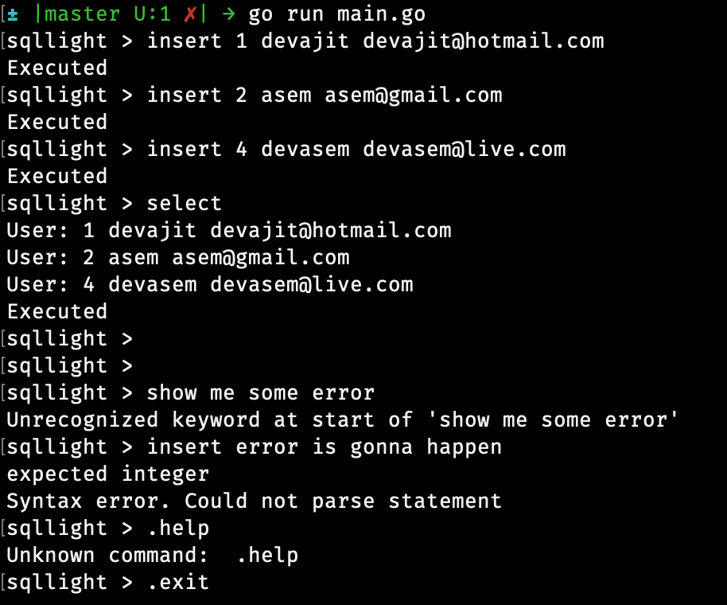

# sqllight
A light SQL database engine using Golang



## Getting Started
I am trying to keep it simple for now, I will improve it further. Currently it supports creating only one table and can perform *insert* and *select* operations.

```
go run main.go
```

### Prerequisites
Only Golang is required.

## Running the tests
```
go test
```

